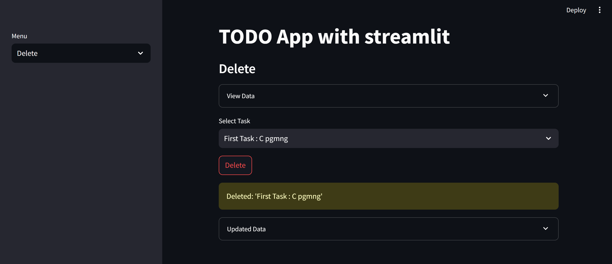

# ToDo APP

A todo app, short for "to-do list" app, is a software application designed to help individuals or teams manage tasks, activities, and goals effectively. It allows users to create, prioritize, and categorize tasks, set reminders, and track progress. Features often include synchronization across devices, recurring tasks, integration with other tools, and collaboration capabilities. 

By using a todo app, users can increase productivity, manage time better, reduce stress, and enhance collaboration. Popular todo apps include Todoist, Microsoft To Do, Trello, Asana, and Any.do. These apps are useful for personal tasks, professional projects, academic schedules, and household management, helping users stay organized and achieve their goals systematically.
<br>

## Todo App Functions

- **Create:** Users can create new tasks with details.

- **Read:** Users can view existing tasks to keep track of their responsibilities.

- **Update:** Users can update tasks as needed, such as changing deadlines or adding notes.

- **Delete:** Users can delete tasks once they are completed or no longer necessary.


## Code Snippet

Here's how you can implement a basic todo app with Streamlit, incorporating the Create, Read, Update, and Delete functionalities:

```python
import streamlit as st

st.title("ToDo App With Streamlit")

# Sidebar menu
menu = ["Create", "Read", "Update", "Delete"]
choice = st.sidebar.selectbox("Menu", menu)
```

The provided code snippet initializes a Streamlit application with a main title and a sidebar menu that includes options for "Create," "Read," "Update," and "Delete" functionalities. Users can select an option from this sidebar menu to perform different actions related to task management.

This setup makes it easy for users to navigate through the app and manage their tasks efficiently. Each menu option corresponds to a particular function within the todo app, offering a straightforward and user-friendly interface for adding, viewing, updating, and deleting tasks.


<br>
<br>

# Create

```python
import sqlite3

def create_table():
    conn = sqlite3.connect('data.db')
    c = conn.cursor()
    c.execute('CREATE TABLE IF NOT EXISTS taskstable(task TEXT, task_status TEXT, task_due_date DATE)')
    conn.commit()
    conn.close()
```

The function `create_table()` is crucial for establishing the foundation of our task management system stored in an SQLite database (data.db). It ensures that a table named 'taskstable' is set up correctly to store tasks. This table includes columns for the task description ('task'), its current status ('task_status'), and its due date ('task_due_date'). By checking if the table already exists before attempting to create it, the function guarantees that our database structure is initialized properly for managing tasks efficiently. This preparation step ensures that tasks can be seamlessly added, viewed, updated, or deleted within our application.


```python
if choice == "Create":
    st.subheader("Add Items")

    # Layout
    col1, col2 = st.columns(2)

    with col1:
        task = st.text_area("Task To Do")

    with col2:
        task_status = st.selectbox("Status", ["ToDo", "Doing", "Done"])
        task_due_date = st.date_input("Due Date")

    if st.button("Add Task"):
        add_data(task, task_status, task_due_date)
        st.success("Successfully Added Data: {}".format(task))
```


In the "Create" section of the Streamlit app, users encounter an interface designed for seamlessly adding new tasks. The interface is divided into two columns for a clear and organized layout. In the first column, users can input the task description using a text area. The second column offers a dropdown menu where users can select the task's status from options such as "ToDo", "Doing", or "Done". Additionally, there's a date picker for specifying the task's due date. Upon pressing the "Add Task" button, the application triggers the add_data() function to incorporate these task details into the SQLite database. A notification confirming the successful addition of the task promptly appears. This intuitive setup ensures users can efficiently input new tasks into the todo app, enhancing their task management experience.


```python
import sqlite3

def add_data(task, task_status, task_due_date):
    conn = sqlite3.connect('data.db')
    c = conn.cursor()
    c.execute('INSERT INTO taskstable(task, task_status, task_due_date) VALUES (?, ?, ?)', (task, task_status, task_due_date))
    conn.commit()
    conn.close()
```


The `add_data()` function is responsible for adding a new task entry into the SQLite database's 'taskstable' table. 

**It accepts three parameters:** 

- **task:** Which describes the task to be added. 

- **task_status:** Indicating whether the task is "ToDo", "Doing", or "Done". 

- **task_due_date:** The deadline for completing the task in 'YYYY-MM-DD' format. 

Inside the function, a connection to the SQLite database is established, followed by creating a cursor object to execute SQL commands. The function constructs an SQL INSERT query that specifies the table ('taskstable') and the columns ('task', 'task_status', 'task_due_date') into which the task details are inserted as values. After executing the query to insert the new task and ensuring the changes are committed to the database, the connection is properly closed to maintain database integrity. This function plays a pivotal role in seamlessly integrating new tasks into the todo app's database, facilitating effective task management and organization.


<br>
<br>

# Read

```python
elif choice == "Read":
    st.subheader("View Items")
    result = view_all_data()
    if result:
        df = pd.DataFrame(result, columns=['Task', 'Status', 'Due Date'])
        with st.expander("View All Data"):
            st.dataframe(df)
        
        with st.expander("Task Status"):
            task_df = df['Status'].value_counts().to_frame()
            task_df = task_df.reset_index()
            st.dataframe(task_df)

            p1 = px.pie(task_df, names='Status', values='count')
            st.plotly_chart(p1)

    else:
        st.write("No tasks found.")
```


In the "Read" section of the Streamlit app, users are presented with an interface to review the tasks stored in the database. If tasks exist in the database, they are displayed in a structured table format that includes details such as task descriptions, statuses (whether they are "ToDo", "Doing", or "Done"), and their respective due dates. Users can expand the "Task Status" section to access additional insights via a pie chart visualization. This chart offers a graphical representation of how tasks are distributed among different status categories, providing users with a clear overview of their task progress and current workload. If no tasks are found in the database, a message is shown indicating that there are no tasks to display. This functionality allows users to easily monitor their tasks, understand their current status distribution, and make informed decisions based on their task management needs.


```python
import sqlite3

def view_all_data():
    conn = sqlite3.connect('data.db')
    c = conn.cursor()
    c.execute('SELECT * FROM taskstable')
    data = c.fetchall()
    conn.close()
    return [row for row in data if row[0]]
```


The `view_all_data()` function retrieves comprehensive information stored in the 'taskstable' table of the SQLite database. It begins by establishing a connection to the database and initializing a cursor to execute SQL commands. The function then issues a SELECT query to fetch all rows from the table, captures the returned data as a list of tuples, and subsequently closes the database connection to maintain data integrity. Each tuple within the resulting list represents a distinct row from the 'taskstable', encompassing details such as task descriptions, statuses (e.g., "ToDo", "Doing", "Done"), and due dates. By encapsulating this retrieval process, the function enables users to seamlessly access and review their entire collection of tasks directly within the Streamlit application interface.


<br>


<br>
<br>

# Update

```python
import sqlite3

def update_data(task, new_task_status, new_task_due_date):
    conn = sqlite3.connect('data.db')
    c = conn.cursor()
    c.execute('UPDATE taskstable SET task_status=?, task_due_date=? WHERE task=?', (new_task_status, new_task_due_date, task))
    conn.commit()
    conn.close()
```
The `update_data()` function is designed to adjust both the status and due date of a specific task stored in the 'taskstable' table within the SQLite database. It accepts three parameters: `task` (describing the task to be updated), `new_task_status` (indicating the task's revised status such as "ToDo", "Doing", or "Done"), and `new_task_due_date` (specifying the new deadline for the task formatted as 'YYYY-MM-DD').

To execute this update, the function constructs an SQL query tailored to modify the 'task_status' and 'task_due_date' columns for the designated task in the database. Once the query is executed and the changes are confirmed via commit, the function ensures the database connection is properly closed to maintain data consistency. This capability enables users to efficiently update and manage task statuses and deadlines within their todo app setup.


```python
elif choice == "Update":
    st.subheader("Edit/Update Items")
    result = view_all_data()
    if result:
        df = pd.DataFrame(result, columns=['Task', 'Status', 'Due Date'])
        with st.expander("Current Data"):
            st.dataframe(df)

        list_of_tasks = [i[0] for i in view_unique_tasks()]
        selected_task = st.selectbox("Task To Edit", list_of_tasks)

        new_task_status = st.selectbox("Status", ["ToDo", "Doing", "Done"])
        new_task_due_date = st.date_input("Due Date")

        if st.button("Update Task"):
            update_data(selected_task, new_task_status, new_task_due_date)
            st.success("Task Updated Successfully")

    else:
        st.write("No tasks found.")
```


In the "Update" section of the Streamlit app, users have access to tools for editing or modifying their existing tasks. If tasks are present in the database, they are showcased in a structured DataFrame format under the "Current Data" expander. Users can navigate through these tasks using a dropdown menu (`selected_task`) to select the specific task they wish to update. Once selected, they can proceed to adjust the task's status (`new_task_status`) using a dropdown menu that includes options like "ToDo", "Doing", or "Done". Furthermore, users can update the task's due date (`new_task_due_date`) by interacting with a date input widget. Upon confirming their edits by clicking the "Update Task" button, the application invokes the `update_data()` function to implement these modifications to the selected task. A notification message promptly informs users of the successful task update. In cases where no tasks are found in the database, a message notifies users of the absence of tasks. This section of the app empowers users to effectively manage and refine the status and deadlines of their tasks within a streamlined and user-friendly interface.


```python
import sqlite3

def view_unique_tasks():
    conn = sqlite3.connect('data.db')
    c = conn.cursor()
    c.execute('SELECT DISTINCT task FROM taskstable WHERE task IS NOT NULL AND task != ""')
    data = c.fetchall()
    conn.close()
    return data
```
The `view_unique_tasks()` function retrieves distinct task descriptions stored in the 'taskstable' table of an SQLite database. It starts by connecting to the database and preparing to execute an SQL query. The query specifically selects task descriptions that are unique (DISTINCT) and not empty or null from the table. After fetching the results, the function closes the database connection and returns a list containing these unique task descriptions. This function serves a practical purpose within the Streamlit app, facilitating the creation of dropdown menus or select boxes populated with existing task options. This capability enables users to easily choose specific tasks for tasks such as editing or deletion directly within the application interface.


<br>
<br>


# Delete

```python
import sqlite3

def delete_data(task):
    conn = sqlite3.connect('data.db')
    c = conn.cursor()
    c.execute('DELETE FROM taskstable WHERE task=?', (task,))
    conn.commit()
    conn.close()
```

The `delete_data()` function is designed to eliminate a particular task entry from the 'taskstable' table within the SQLite database. It accepts one parameter, `task`, which specifies the description of the task to be removed. To achieve this, the function constructs an SQL query tailored to delete the row associated with the specified task from the database table. Once the query is executed and the changes are committed to the database using `conn.commit()`, the function ensures the database connection is properly closed. This capability enables efficient management and removal of tasks from the todo app's database, streamlining task organization and maintenance.


```python
elif choice == "Delete":
    st.subheader("Delete Items")
    result = view_all_data()
    df = pd.DataFrame(result, columns=['Task', 'Status', 'Due Date'])
    with st.expander("Current Data"):
        st.dataframe(df)
    
    list_of_tasks = [i[0] for i in view_unique_tasks()]
    selected_task = st.selectbox("Task To Delete", list_of_tasks)
    st.warning("Do you want to delete {}".format(selected_task))
    if st.button("Delete Task"):
        delete_data(selected_task)
        st.success("Task has been successfully deleted")
```


In the "Delete" section of the Streamlit app, users are presented with tools to manage their tasks by removing specific entries from their todo list. Initially, all existing tasks are displayed in a structured DataFrame format within the "Current Data" expander. To initiate deletion, users select the task they wish to remove from a dropdown menu (`selected_task`). A cautionary prompt confirms the user's intent to delete the chosen task. Upon confirming deletion by clicking the "Delete Task" button, the application triggers the `delete_data()` function, which promptly removes the selected task from the database. A confirmation message then assures users that the task deletion was successful. This feature offers a user-friendly approach to efficiently managing and organizing tasks within the todo app interface.
<br>

